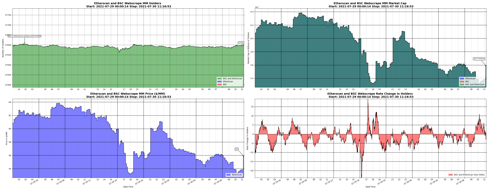

# MilionToken

All Things Million Token (MM)

Run ether_scrape.py in one terminal and then in another terminal run graph.py \*

Run graph.py like this as an example:
python3.9 graph.py '2021-07-23 12:00:00' '2022-07-30 00:00:00'

If all goes well, you should get an automatically updating graph with database text files that look like the following

